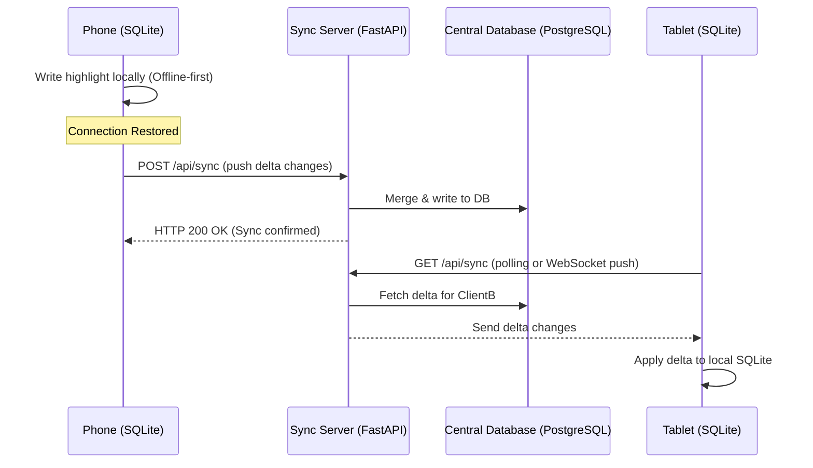
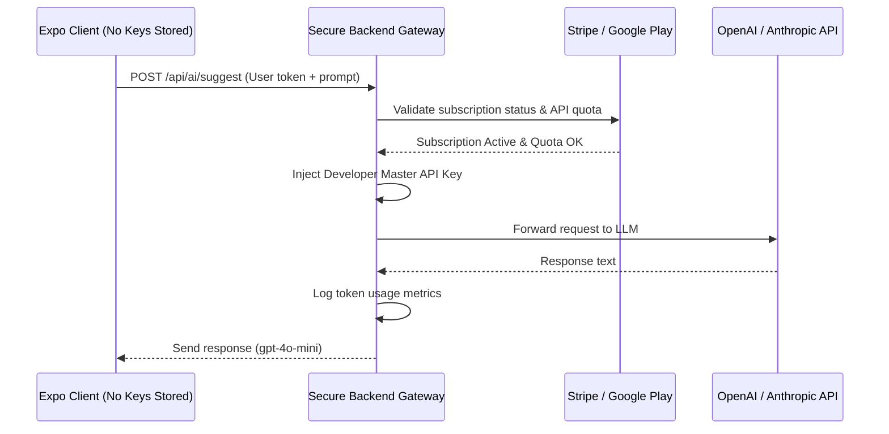

# Future Features & Backend Architecture Roadmap

This document outlines the proposed features that will transition the **Ebook Reader & Editor** from a standalone, client-first application into a cloud-connected platform. It details why a backend is required for each capability, how the architecture will change, and the planned implementation phases.

---

## 🗺️ Feature Roadmap Matrix

| Feature | Backend Requirement | Tech Stack Recommendations | Complexity |
| :--- | :--- | :--- | :--- |
| **1. Cloud Sync** | Sync progress, highlights, and libraries across devices | PostgreSQL/MySQL + REST/GraphQL API | Medium |
| **2. Managed SaaS AI** | Sell AI features under a subscription without user API keys | API Gateway + Stripe Webhooks + Rate Limiting | Medium |
| **3. Real-time Collaboration** | Multi-author live editing of book drafts | WebSocket server + Yjs / Automerge (CRDTs) | High |
| **4. Publishing & DRM** | Ebook store, secure payment processing, and download protection | Stripe + CDN with Signed URLs + DRM Key Server | High |
| **5. Social & Community** | Public notes, book reviews, recommendations, and book clubs | Relational DB / Graph DB (for social connections) | Medium |
| **6. Scanned PDF OCR** | Heavy OCR conversion of images to editable text | Celery/Redis Task Queue + Tesseract OCR / Cloud Vision | Medium |
| **7. Manuscript Resurrection** | Parse, analyze, and rebuild raw drafts via multi-agent flows | Python Backend + **CrewAI** + Structured EPUB Parser | High |

---

## 🏗️ Architecture Design Patterns

Below are the architectural layouts showing how the app will interact with the future backend.

### 🔄 1. Multi-Device Cloud Sync Flow
Syncs the library database using a local-first replication protocol. The client writes to the local SQLite database first, then pushes/pulls changes asynchronously to/from the sync server.

### 🔑 2. Managed SaaS AI Gateway Flow
Shields developer API credentials from client decompilation and manages user usage/subscriptions.

---

## 🛠️ Detailed Feature Specifications

### 1. Cross-Device Synchronization
* **The Goal:** Seamlessly transitions the reading session from phone to web.
* **Backend Responsibilities:**
  * Authentication (OAuth2, JWT, Google/Apple Sign-in).
  * Delta sync API tracking version vectors or timestamps per table row.
  * Conflict resolution rules (e.g., "latest update wins" for reading progress, "union merge" for highlights).
* **Storage Model:** A relational schema in PostgreSQL matching the client-side database schema.

### 2. Managed SaaS AI Gateway
* **The Goal:** A premium monetization path. The free tier uses user-provided API keys; the Pro tier uses the developer's high-speed API keys wrapped in subscription management.
* **Backend Responsibilities:**
  * Integrates Stripe Webhooks to monitor subscription state.
  * Encapsulates the master keys securely inside server environment variables.
  * Measures tokens used per account to enforce fair-use limits.

> [!IMPORTANT]
> To prevent billing exploits, the backend will reject requests if a user consumes more than their monthly token allotment.

### 3. Real-Time Collaboration
* **The Goal:** Co-authoring a book dynamically.
* **Backend Responsibilities:**
  * Socket.io / WebSocket server mapping active editors to `room_ids` matching the document ID.
  * Document state synchronization using CRDT libraries like **Yjs** or **Automerge**.
  * Auto-saving document milestones to PostgreSQL as versions.

### 4. Book Store, Publishing, & DRM
* **The Goal:** Monetizing completed books via an in-app marketplace.
* **Backend Responsibilities:**
  * Integration with Google Play Billing / Apple In-App Purchases.
  * Secure media CDN storing published files (.epub, .pdf) in private buckets (e.g., AWS S3).
  * Generation of time-expiring signed URLs for authenticated download access.

### 5. Desktop Manuscript Resurrection Tool (CrewAI Integration)
* **The Goal:** Reconstruct and polish legacy, corrupted, or draft manuscripts (.epub, .txt, .pdf) automatically, preparing them for publication-quality output.
* **Backend Responsibilities:**
  * **Structured EPUB/Doc Parser:** Splits incoming manuscripts into chapter-by-chapter, scene-by-scene JSON objects. This keeps model tokens small and prevents context window overflows.
  * **CrewAI Orchestrator (Python):** Deploys a team of specialized AI agents:
    * *Style Mirroring Agent:* Learns the author's tone, voice, and narrative rhythm from healthy sections.
    * *Plot Auditor Agent:* Analyzes narrative consistency, characters, and structural holes.
    * *Ingestion & Formatting Agent:* Reconstructs corrupted HTML/CSS styling tags, converting the raw inputs into clean Markdown or XHTML.
  * **Compilation Engine:** Aggregates agent output back into a valid book entity to be downloaded as an `.epub` or synced straight to the local SQLite database.

---

> [!TIP]
> **Suggested Tech Stack for this Backend:** FastAPI (Python) for rapid, high-performance API endpoints, PostgreSQL for robust data relations, and Redis for real-time WebSocket state and task queues. CrewAI integrations run perfectly within Python's runtime environment alongside these components.
